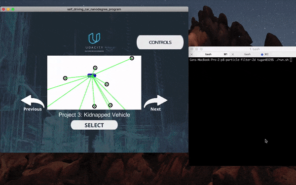

# 2D Particle Filter

[](http://www.udacity.com/drive)

## Overview

In this project, I'll implement and utilize a 2 dimensional particle filter to localize the state of a moving object of interest, with noisy GPS estimate as the initial location and lots of **noisy** sensor and control measurement/observation data.

## Project Demo



You can also watch a demo video of this project [on my YouTube](https://youtu.be/mjAwewJjqmA)

**Visual Markers**

**Black Markers** are known landmarks.

**Green** lines are sensor measurement for landmark observation.

**Blue Car** is the ground truth car location.

**Blue Circle** is the predicted car location using the particle filter.

## Project Setup

This project involves the Simulator which can be downloaded [here](https://github.com/udacity/self-driving-car-sim/releases)

This repository includes two bash files (`install-mac.sh` and `install-ubuntu.sh`) that can be used to set up and install [uWebSocketIO](https://github.com/uWebSockets/uWebSockets) for either Linux or Mac systems. 

For windows you can use either Docker, VMware, or even [Windows 10 Bash on Ubuntu](https://www.howtogeek.com/249966/how-to-install-and-use-the-linux-bash-shell-on-windows-10/) to install uWebSocketIO. 

## Run the Project


Once the install for uWebSocketIO is complete, the main program can be built and ran by doing the following from the project top directory.

```
1. mkdir build
2. cd build
3. cmake ..
4. make
5. ./particle_filter
```

Alternatively some scripts have been included to streamline this process, these can be leveraged by executing the following in the top directory of the project:

```
1. ./clean.sh
2. ./build.sh
3. ./run.sh
```

Then, you can open the [Simulator you downloaded](https://github.com/udacity/self-driving-car-sim/releases) and choose "Project 3" to run the project.


## Communication Protocol

Here is the main protocol that `main.cpp` uses for uWebSocketIO in communicating with the simulator.


**Input**: values provided by the _simulator_ to the _c++ program_

```
// sense noisy position data from the simulator

["sense_x"]

["sense_y"]

["sense_theta"]


// get the previous velocity and yaw rate to predict the particle's transitioned state

["previous_velocity"]

["previous_yawrate"]


// receive noisy observation data from the simulator, in a respective list of x/y values

["sense_observations_x"]

["sense_observations_y"]
```

**Output**: values provided by the _c++ program_ to the _simulator_

```
// best particle values used for calculating the error evaluation

["best_particle_x"]

["best_particle_y"]

["best_particle_theta"]


//Optional message data used for debugging particle's sensing and associations

// for respective (x,y) sensed positions ID label

["best_particle_associations"]


// for respective (x,y) sensed positions

["best_particle_sense_x"] <= list of sensed x positions

["best_particle_sense_y"] <= list of sensed y positions
```


## Inputs to the Particle Filter

#### The Map*

`map_data.txt` includes the position of landmarks (in meters) on an arbitrary Cartesian coordinate system. Each row has three columns

1. x position
2. y position
3. landmark id

_*(map data provided by 3D Mapping Solutions GmbH.)_

#### All other data the simulator provides, such as observations and controls.


